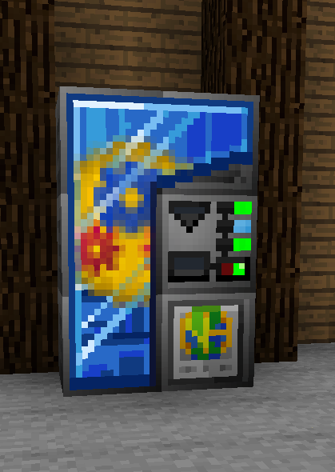

## Introduction

This mod adds a vending machine, unlocking trades based on questbook data. If you have AE2 installed, it will also add an AE2 vending terminal, which will allow you perform trades directly with items from your ME system.

### Structure

### Interface

### Command

**Note: All commands require OP to run**.

If your command still refuses to run, ensure your OP permission level in server.properties is set to 4.

|Task| Command                                           |
|--|---------------------------------------------------|
|**Set coin**| `/vending set [player] <coin_type\|all> <amount>` |
|**Add coin**| `/vending add [player] <coin_type\|all> <amount>` |
|**Reset coins**| `/vending reset [player] <coin_type\|all>` |
|**Reload database** | `/vending reload database` |
|**Reload trade state**| `/vending reload tradestate [player]` |

## Current Status

Alpha Testing

## For Non-GTNH Modpacks

This can be used as a standalone mod with several dependencies. The vending machine block and ME Vending Uplink do not come with default recipes.

### Required Dependencies:
- GT5Unofficial-GTNH (Not compatible with main GT5U branch!)
- ModularUI 2
- NotEnoughItems
- Applied Energistics 2

### Optional Dependencies:
- BetterQuesting

## Credits

Credits to **BetterQuesting** for their implementation of networking and file serialization/deserialization, which are used in this project. We do not reference the classes directly to avoid having BetterQuesting as a required dependency.

Credits to **NH Coremod** for the coin textures used in the GUI.

The BetterQuesting license may be found in the root directory of this project as LICENSE.betterquesting.

The NHCoreMod licenese may be found in the root directory of this project as LICENSE.NewHorizonsCoreMod.
